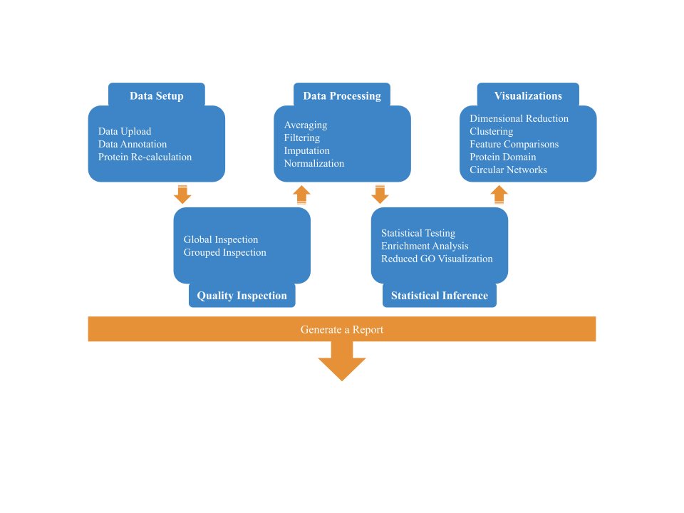

# Simple Quantitative Analysis of Proteins and PTMs (SQuAPP)
SQuAPP is a workflow-based web application built on R-Shiny to enable rapid high-level analysis of quantitative proteomics data. SQuAPP provides streamlined and straightforward access to many aspects of typical downstream analysis done with quantitative proteomics data. SQuAPP can bring multiple levels of proteomics data to process and visually compare them for further visualizations.

- [SQuAPP Features](#squapp-features)
- [Usage](#usage)
  - [Online Version](#online-version)
  - [Local Installation](#local-installation)
  - [Docker Installation](#docker-installation)
- [Code of Conduct](#code-of-conduct)
- [Session Info](#session-info)

> This document introduces the tool and how to access it. To get further information about the functionality and step-by-step tutorial, visit the [ wiki page ](https://github.com/LangeLab/SQuAPP/wiki) of the repository or follow through in [SQuAPP's](http://squapp.langelab.org/) home page.

[](https://www.youtube.com/watch?v=tczeMi8aC3I)


---

# SQuAPP Features
SQuAPP provides features for the most commonly used downstream data analysis approaches and some new functionality to combine multiple data levels, e.g. protein-peptide-ptms. Here is a quick look at the functionality offered within SQuAPP.

<p align="center">
  
</p>

- **Data Setup**
  - Multiple-level tabular data input from any tool
  - Data annotation for peptide and ptm data levels for expanded information for external tools such as ROLIM
  - Protein re-calculation from peptide level data
- **Data Inspection**
  - Global and Grouped quality check
    - Distribution of Samples: Violin
    - Coefficient of variation (CV)
    - Identified features
    - Data Completeness
    - Missing values
- **Data Processing**
  - Collapsing replica with averaging
  - Sub-par sample filtering
  - Data completeness-based filtering
  - Data imputation
  - Data normalization
- **Statistical Inference**
  - Statistical testing
  - Enrichment analysis
  - Reduced and grouped visualization for GO Enrichment *`(WIP)`*
- **Summary Visualizations**
  - Dimensional reduction
  - Data clustering
  - Feature intensity comparison
  - Protein domain
  - Circular network summary
- **Report Generation** *`(WIP)`*

# Usage
SQuAPP can be accessed by different means: online, local installation, and docker installation.

## Online Version
We have a ready-to-be-accessed version of SQuAPP [squapp.langelab.org](http://squapp.langelab.org/). The online version is to provide quick access to the features without installing or configuring the local version.
> While using the server is desirable, you might experience access issues due to server limitations when the server is overloaded.

## Local Use
If you want to use SQuAPP on your local computer to avoid server limitations, you can follow the outlined steps to install it on your local computer.

> We provide a script that checks if all necessary packages are installed and installs them if they are not. The automated dependency installation is tested only in a Linux system. If there are any issues during or after installation, please open an issue in [this repository.](https://github.com/LangeLab/SQuAPP/issues/new)

### **Step 0** - R and RStudio Installation
> **This step is for users who don't have R and RStudio in their system. You can ignore this step if you already have them on your local machine and don't wish to do a clean install.**

#### Windows
- Download R for windows from the [official cran website.](https://cran.rstudio.com/bin/windows/base/)
- Install R by opening the *.exe file and following instructions.
- Download RStudio installer (RStudio-*.exe) file from the [official website.](https://www.rstudio.com/products/rstudio/download/#download)
- Install RStudio by opening *.exe file and following the instructions.

#### macOS
- Download R for macOS from the [official CRAN website.](https://cran.rstudio.com/bin/macosx/).
  - *Important:* Careful when selecting the appropriate silicon version (Apple's M-series or Intel chips.)
- Install R by opening *.pkg file and following the instructions.
- Download RStudio installer (RStudio-*.dmg) file from the [official website.](https://www.rstudio.com/products/rstudio/download/#download)
- Install RStudio by opening *.dmg file and following the instructions

#### Linux
> For this installation section for Linux, we picked Ubuntu as the example distro. If your local machine has another Linux distro, you can find instructions specific to it on the [official cran website.](https://cran.rstudio.com/bin/linux/)

- Install R by following the instructions
  - ```sudo apt update -qq```
  - ```sudo apt install --no-install-recommends software-properties-common dirmngr```
  - ```wget -qO- https://cloud.r-project.org/bin/linux/ubuntu/marutter_pubkey.asc | sudo tee -a /etc/apt/trusted.gpg.d/cran_ubuntu_key.asc```
  - ```sudo add-apt-repository "deb https://cloud.r-project.org/bin/linux/ubuntu $(lsb_release -cs)-cran40/"```
    - *These instructions put the R 4.0+ release repository to ubuntu, making the update and keep-up easier.*
  - ```sudo apt install --no-install-recommends r-base```
- Download the RStudio installer appropriate for your Linux distro and version from [official website](https://www.rstudio.com/products/rstudio/download/#download)
- Use your installer of choice to install the downloaded *.deb file.
  - *We prefer using gdebi command line tool to install since it automatically downloads and installs required dependencies.*
- Install non-R dependencies for packages to be installed correctly
  - ```sudo apt install build-essential libcurl4-gnutls-dev libxml2-dev libssl-dev libharfbuzz-dev libfribidi-dev```

### Step 1 - Get the Source Code
You can click on the "Code," which will give you an option to either `Clone or Download ZIP`. You can clone the repository locally by using the link `git clone https://github.com/LangeLab/SQuAPP.git,` or you can download it as ZIP and then unzip it to get it ready for use.

### Step 2 - Installing Dependencies
In the RStudio, run the script `install_dependencies.R`, which will check if the required packages are installed and install the ones that are not already installed.

> The script checks the packages listed in these files:
- [Cran Packages](./dep/cran_packages.txt)
- [GitHub Packages](./dep/github_packages.txt)
- [Bioconductor Packages](./dep/bioconductor_packages.txt)

### Step 3 - Running the App Locally
In the RStudio, you can run the shiny app by clicking the "Run App" option.

## Docker Installation
> This part is still a work in progress!

# Code of Conduct
Please note that SQuAPP is released with a [Contributor Code of Conduct](./CODE_OF_CONDUCT.md). By contributing to this project, you agree to abide by its terms.


# Session Info
```R
> sessionInfo()
R version 4.1.0 (2021-05-18)
Platform: x86_64-pc-linux-gnu (64-bit)
Running under: Pop!_OS 21.04

Matrix products: default
BLAS:   /usr/lib/x86_64-linux-gnu/openblas-pthread/libblas.so.3
LAPACK: /usr/lib/x86_64-linux-gnu/openblas-pthread/libopenblasp-r0.3.13.so

locale:
 [1] LC_CTYPE=en_CA.UTF-8       LC_NUMERIC=C               LC_TIME=en_CA.UTF-8       
 [4] LC_COLLATE=en_CA.UTF-8     LC_MONETARY=en_CA.UTF-8    LC_MESSAGES=en_CA.UTF-8   
 [7] LC_PAPER=en_CA.UTF-8       LC_NAME=C                  LC_ADDRESS=C              
[10] LC_TELEPHONE=C             LC_MEASUREMENT=en_CA.UTF-8 LC_IDENTIFICATION=C       

attached base packages:
[1] stats     graphics  grDevices utils     datasets  methods   base     

other attached packages:
 [1] circlize_0.4.13       patchwork_1.1.1       ggpubr_0.4.0          plotly_4.10.0        
 [5] ggplot2_3.3.5         limma_3.48.3          MsCoreUtils_1.4.0     reshape2_1.4.4       
 [9] feather_0.3.5         stringr_1.4.0         tidyr_1.1.4           dplyr_1.0.7          
[13] fresh_0.2.0           shinycssloaders_1.0.0 shinyWidgets_0.6.2    tippy_0.1.0          
[17] DT_0.19               bs4Dash_2.0.3         shiny_1.7.1          

loaded via a namespace (and not attached):
 [1] fontawesome_0.2.2   httr_1.4.2          tools_4.1.0         backports_1.3.0     bslib_0.3.1        
 [6] utf8_1.2.2          R6_2.5.1            DBI_1.1.1           lazyeval_0.2.2      BiocGenerics_0.38.0
[11] colorspace_2.0-2    withr_2.4.2         tidyselect_1.1.1    curl_4.3.2          compiler_4.1.0     
[16] sass_0.4.0          scales_1.1.1        digest_0.6.28       foreign_0.8-81      rio_0.5.27         
[21] pkgconfig_2.0.3     htmltools_0.5.2     fastmap_1.1.0       htmlwidgets_1.5.4   rlang_0.4.12       
[26] GlobalOptions_0.1.2 readxl_1.3.1        rstudioapi_0.13     shape_1.4.6         jquerylib_0.1.4    
[31] generics_0.1.1      jsonlite_1.7.2      crosstalk_1.1.1     zip_2.2.0           car_3.0-11         
[36] magrittr_2.0.1      Rcpp_1.0.7          munsell_0.5.0       S4Vectors_0.30.2    fansi_0.5.0        
[41] abind_1.4-5         lifecycle_1.0.1     yaml_2.2.1          stringi_1.7.5       carData_3.0-4      
[46] MASS_7.3-54         plyr_1.8.6          grid_4.1.0          parallel_4.1.0      promises_1.2.0.1   
[51] forcats_0.5.1       crayon_1.4.1        haven_2.4.3         hms_1.1.1           pillar_1.6.4       
[56] markdown_1.1        ggsignif_0.6.3      stats4_4.1.0        glue_1.4.2          data.table_1.14.2  
[61] vctrs_0.3.8         httpuv_1.6.3        cellranger_1.1.0    gtable_0.3.0        purrr_0.3.4        
[66] clue_0.3-60         assertthat_0.2.1    cachem_1.0.6        xfun_0.27           openxlsx_4.2.4     
[71] mime_0.12           xtable_1.8-4        broom_0.7.9         rstatix_0.7.0       later_1.3.0        
[76] viridisLite_0.4.0   tibble_3.1.5        cluster_2.1.2       ellipsis_0.3.2   
```
