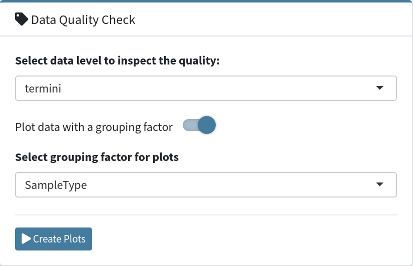
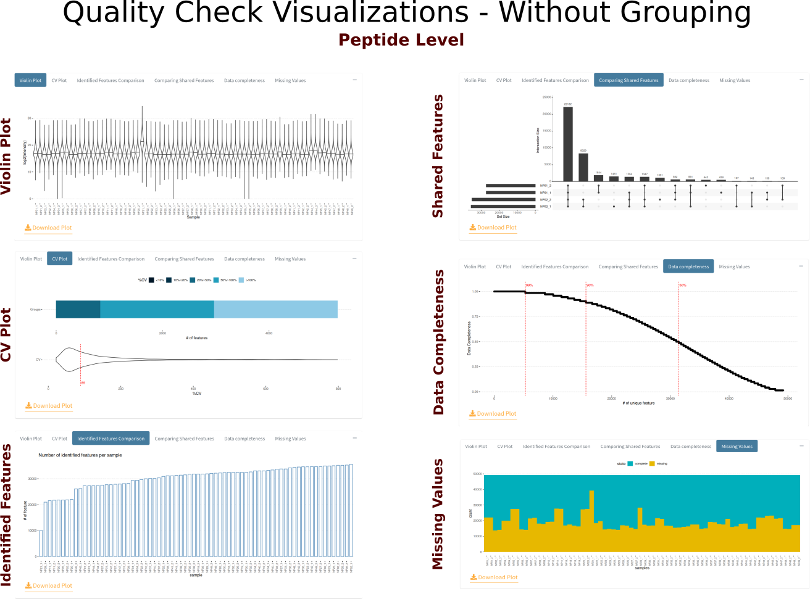
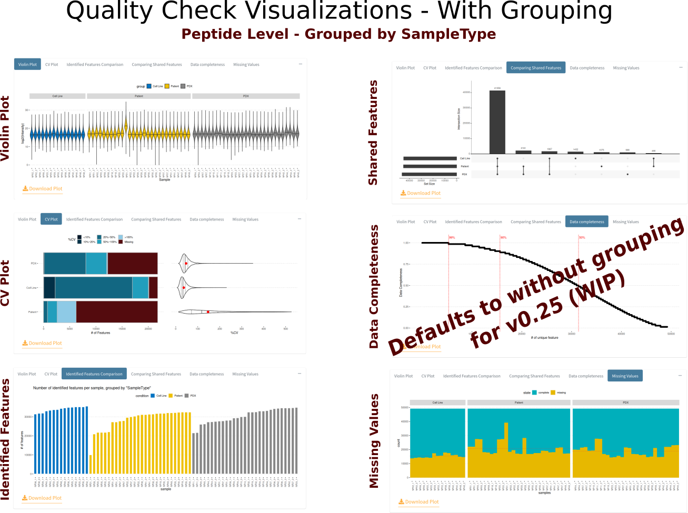

[Add Cover Figure (landscape format)]

The data inspection section provides common sample-based quality check (QC) visualizations for evaluation of each of the study datasets uploaded in step 1.

There are two major ways to inspect your data one is to look at global quality and other is to apply a grouping variable coming from the metadata to group the samples for checking the quality of the data. When the "Plot data with a grouping factor" switch is turned on you can select a metadata column for grouping.

All the plots are created by configuring your selections and then clicking the "Create Plots" button. Whenever you want to update your configuration, for instance changing the data level or changing the grouping condition, you need to click the "Create Plots" again to re-do the plots.

  

The plots are contained in their own tabs, which allowed SQuAPP to be more clean and easy to use with a wide variety of screen resolutions.

  

Here are the QC visualizations to explore your data in detail:
- `Violin plot`: Distribution of the samples visualized over log2 of intensity
- `CV Plot`: Visualizes the coefficient of variation (CV) percentage of features by grouping them on with CV percent groups (<10%, 10%-20%, 20%-50%, 50%-100%, >100%) and a global violin plot of the percent CVs.
	- **Coefficient of variation is calculated by the ratio of the standard deviation of samples to the mean of samples for a given feature.**
- `Identified Features Comparison`: Visualizes the number of unique features a sample contains as a bar plot
- `Comparing Shared Features`: Visualizing the number of features that are shared between different samples as an upset plot.
	- **This plot is most useful when used with a grouping factor**
	- **Using without grouping factor defaults to first 4 samples in your data to show only, you can bypass this by selecting the unique sample identifier in the grouping factor variable, however upset plots are not most useful with too many samples**
- `Data Completeness`: Visualizes the data completeness percentage over a number of unique features.
- `Missing Values`: Visualizes the number of missing values per sample with a stacked bar chart.

All plots that have been displayed and inspected will later be included in the report or can be directly downloaded individually on their tabs.

  

---

  

