[Add Cover Figure (landscape format)]

A prior quality check (QC) review might reveal the need for data pre-processing. `SQuAPP` offers multiple methods for each category of data preprocessing: averaging replicates, filtering data, imputing and normalizing your data.

`SQuAPP` offers flexible methods and options when it comes to changing your data. Each category of data preprocessing follows a similar structure of showing the original state of the data on the top result box and the altered state of the data on the bottom result box. Both of the boxes contain visualizations and data tables. *The plots and data tables can be downloaded individually for reference*.

> `SQuAPP` doesn’t automatically update your dataset when you apply a change but offers a button to approve the change. Whenever you are done with configuration and checked with the provided visuals for each preprocessing category, you must click on this button to save the data as the original.

### 1. Data Averaging
If the replica metadata is provided, data averaging collapses the replicas into the same sample by averaging the replicas.

When the data level is selected, and the “Average Replica” button is clicked, `SQuAPP` provides a simple violin plot and a quantitative data preview for both original and averaged states for comparison. Suppose you choose to continue with the averaged state of a selected data level. In that case, you must switch on the “Want to replace it with original data” button and click the “Record as Original” button to save the averaged state.

  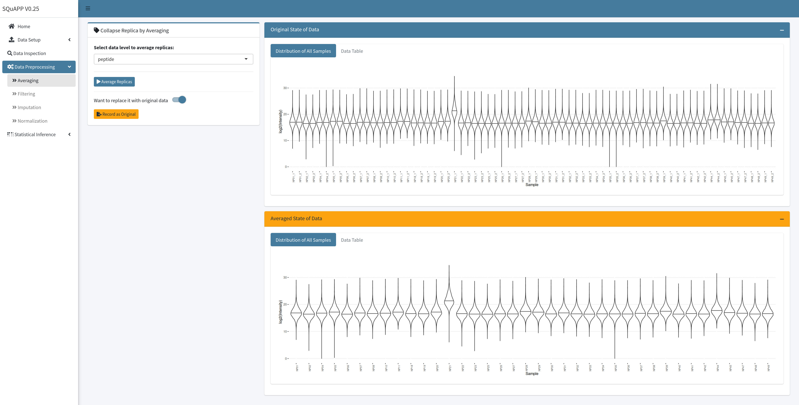

### 2. Data Filtering

Using `SQuAPP,` you can remove one or more samples and remove features with low data completeness.

> `SQuAPP` provides two major versions to look at the data completeness and apply filtering on the data; global and grouped. To view the data completeness by adding grouping variables, switch on the “Do you want to preview plots with grouping” and “Do you want to filter by metadata groups?” options to access variable selection input.

  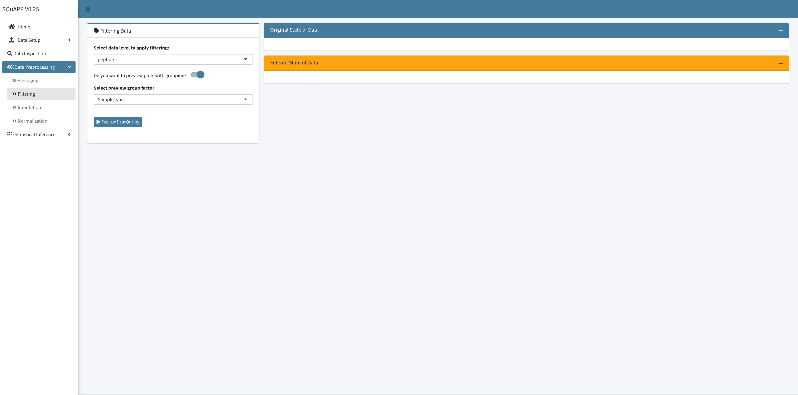

To provide a friendly interface, `SQuAPP` offers a data quality preview specifically for data completeness to decide if you want to filter by data completeness and by what percentage you want your features to be complete to keep them. There are two plots and two tables available for both “Original State of Data” and “Filtered State of Data”:

- `Data Completeness - Count Plot`:  Bar plot showing the number of complete samples over the number of features.
- `Data Completeness - Percentage Plot`: Stacked bar plot showing the number of features belonging to each percentage group for visualizing data completeness.
- `Data Table`: Selected data level
- `Summary Statistics`: Summary statistics of the selected data level

When you click the “Preview Data Quality” button after selecting data level and if you want grouped preview’s select grouping variable, the “Original State of Data” box will be available.

  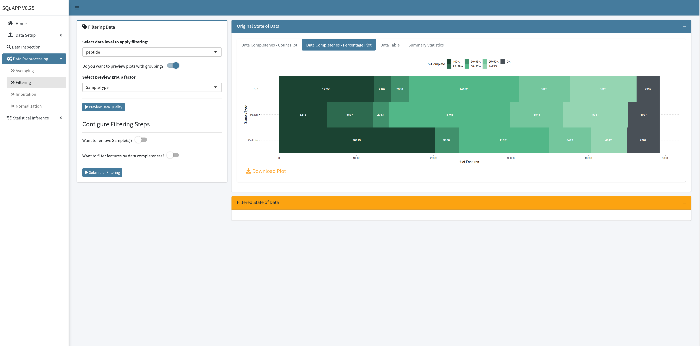

When the “Preview Data Quality” button is clicked and the “Original State of Data” box is populated, the options to configure filtering will appear. Two switches indicate two simple filtering functions available in `SQuAPP`: (i) removing samples from the selected data level and (ii) filtering features by data completeness. If you choose to switch on the removing samples option, you could select one or more sample names from the drop-down menu to be removed from the data. If you decide to filter features by data completeness, you could use the slider to indicate the percentage of data completeness to allow in your data. When the filter features by data completeness switch are on, another switch opens up to filter by grouping variables based on the metadata column. The grouping variable makes the percentage of data completeness applied to each group instead of global.

  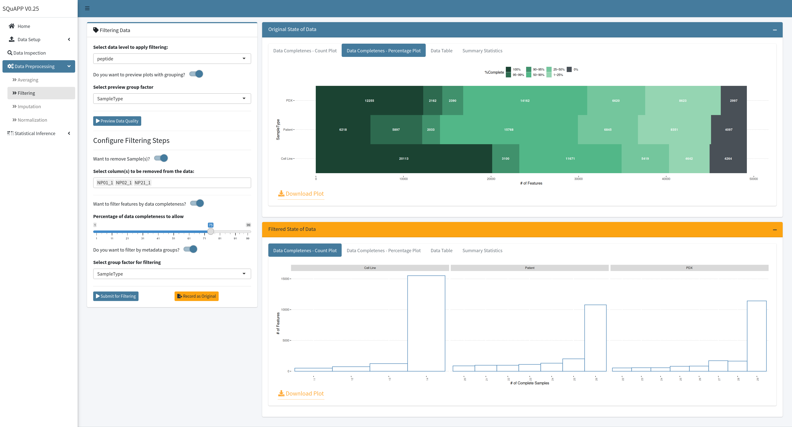

After you have decided to go with the filtered state, you must click on the “Record as Original” button to replace the original data with the updated state.

---

### 3. Data Imputation
Missing values are a common issue in proteomics data. With filtering data, imputation can allow some features to be included without excluding large portions of the features removed from the data.

`SQuAPP` can apply common data imputation methods globally or group-wise. As of version 0.28 `SQuAPP` offers 5 imputation methods four of which utilizing [`impute_matrix()`](https://rformassspectrometry.github.io/MsCoreUtils/reference/imputation.html) function from [`MsCoreUtils`](https://rformassspectrometry.github.io/MsCoreUtils/index.html) package<b>[1](#Bibliography)</b> :

- `min`: Applies minimum value in the data (or grouped subset) to all missing values
- `knn`: Calculates the nearest neighbour averaging to replace the missing value as implemented in the [`impute::impute.knn`](https://rdrr.io/pkg/impute/man/impute.knn.html) function.
- `with`: Applies user-selected value with to all missing values
- `MinProb`: Randomly draws values from Gaussian distribution centred to a minimum value in the data. Implements the [`imputeLCMD::impute.MinProb`](https://rdrr.io/cran/imputeLCMD/man/impute.MinProb.html) function.

  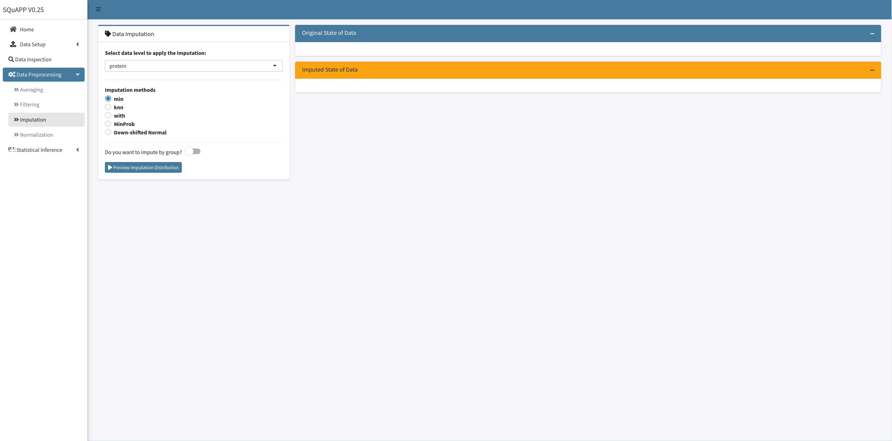

- `Down-shifted Normal`: Custom function imputes missing values with a random value selected from a narrower normal distribution with a smaller mean shifted by a user-selected magnitude.
  - This custom imputation that uses the logic of [down-shifted normal imputation](http://coxdocs.org/doku.php?id=perseus:user:activities:matrixprocessing:imputation:replacemissingfromgaussian&s[]=imputation) used in Perseus<b>[2](#Bibliography)</b>.

  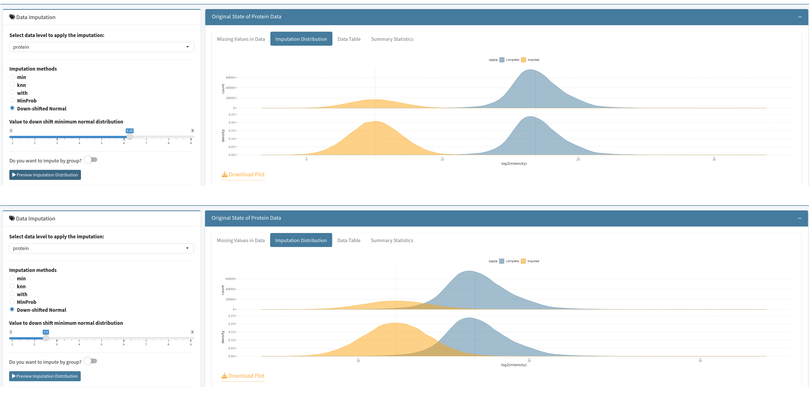 # New Image Showing Downshifted Normal Use

After selecting a data level, the imputation method, and group factor (if you switch on the “impute by group” option), you can click on “Preview Imputation Distribution” to access preview visualizations and data tables provided by `SQuAPP`:

- `Missing values in Data`: Stacked bar plot to visualize the data missingness by sample (taken from quality check section)
- `Imputation Distribution`: Combined density and count distributions of complete and imputed values to visualize
- `Data Table`: Selected data level’s original state as a data table
- `Summary Statistics`: Selected data level’s summary statistics

Previewing the data with your configuration allows you to see how planned imputation affects the data. You can update the parameters and click the preview button again to update the previews to see more versions of how your data would change with a given imputation setup.

  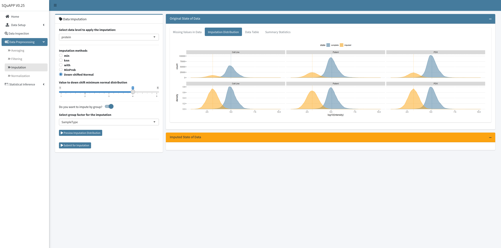

After choosing an imputation configuration, click on the “Submit for Imputation,” which will enable the “Imputed State of Data” box, allowing the direct comparison between original and imputed states:

- `Split Violin`: Split violin to visualize the comparison of original vs imputed distribution of each sample.
- `Data Table`: Imputed state as a data table
- `Summary Statistics`: Imputed state’s summary statistics

To save the imputed state as the original data, click the “Record as Original” to prompt `SQuAPP` to save the imputed state as the original data.

  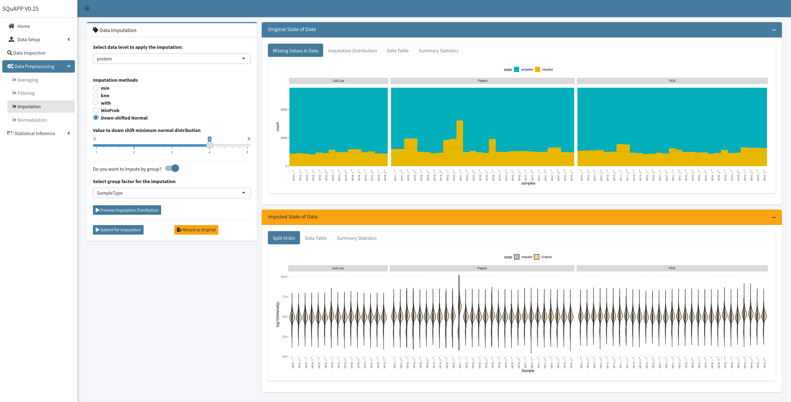

---

### 4. Data Normalization
Data normalization is a crucial step in a data analysis workflow to control for and/or reduce variability in mass spectrometry data comparison between samples.

`SQuAPP` can apply commonly used data normalization methods in a global or group-wise fashion. As of version 0.28, `SQuAPP` offers 5 normalization methods customized from the [`normalize_matrix()`](https://rformassspectrometry.github.io/MsCoreUtils/reference/normalize.html) function from [`MsCoreUtils`](https://rformassspectrometry.github.io/MsCoreUtils/index.html) package<b>[1](#Bibliography)</b> :

- `Divided by Max`: *Dividing each feature by the maximum value of the feature*
- `Divided by Sum`: *Dividing each feature by the sum of the feature*
- `Divided by Mean`: *Divides values by column means*
- `Divided by Median`: *Divides values by column median*
- `Variance Stabilization`<b>[3](#Bibliography)</b>: *Implements variance stabilization method from [`vsn::vsn2()`](https://rdrr.io/bioc/vsn/man/vsn2.html)*

  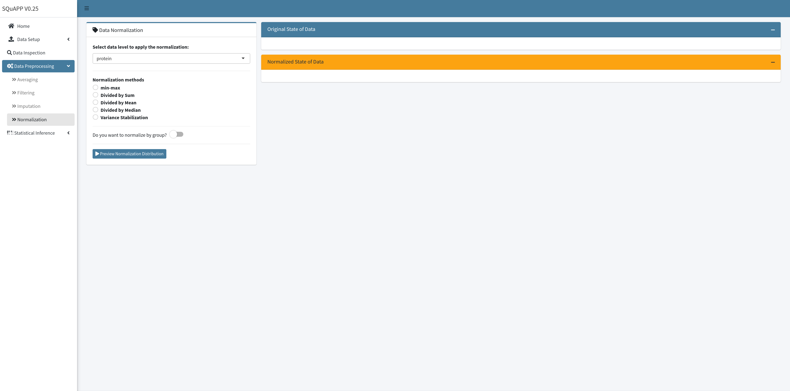

After selecting a data level, the normalization method, and group factor (if you switch on the “normalize by group” option), you can click on “Preview Normalization Distribution” to access preview visualizations and data tables provided by `SQuAPP`:

- `Violin - Distribution of Data`: Violin plot to visualize sample distributions (taken from quality check section)
- `Density - Distribution of Data`: Density plot to visualize global and sample-wise densities.
- `Paired Plots`: Paired plot to visualize sample pairs with matrix layout. (**Since pair plot works best 2 to 10 samples, plot defaults to first four samples. This plot can be updated with the setting tab located in the upper left corner of the plot.  **)
  - **Lower triangle:** scatter plot with the linear fit
  - **Upper triangle:** correlation value with significance indicator
  - **Diagonal:** histogram
- `Data Table`: Selected data level as a data table
- `Summary Statistics`: Selected data level’s summary statistics

  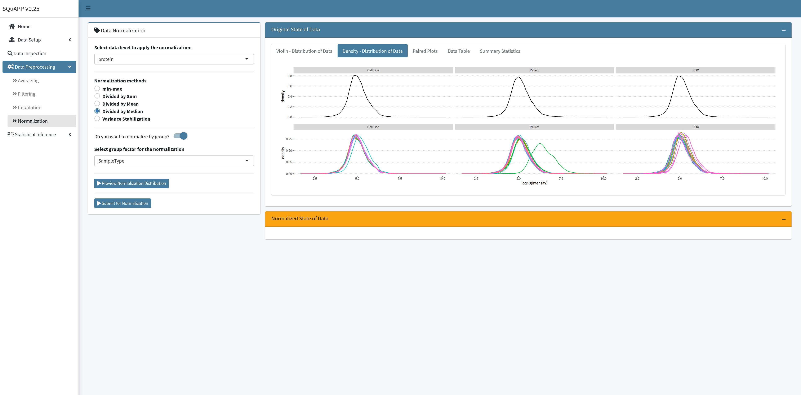

When you check the preview of the original state of the data and decide on the normalization configuration, you can click on the “Submit for Normalization,” which will enable the “Normalized State of Data” to compare the original vs normalized states directly.

To save the normalized state as the original data, you must click the “Record as Original” to prompt `SQuAPP` to save the normalized state as the original data.

  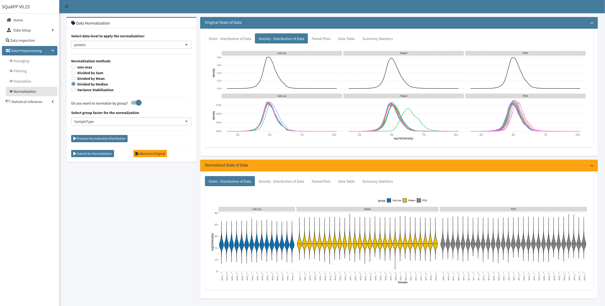

---

<h3 align="center"><b>Bibliography</b></h3>

1. [Rainer J, Vicini A, Salzer L, Stanstrup J, Badia JM, Neumann S, et al. A modular and expandable ecosystem for metabolomics data annotation in R. Metabolites. 2022;12.](https://www.mdpi.com/2218-1989/12/2/173)
2. [Tyanova S, Temu T, Sinitcyn P, Carlson A, Hein MY, Geiger T, et al. The Perseus computational platform for comprehensive analysis of (prote)omics data. Nat Methods. 2016;13:731–40.](https://doi.org/10.1038/nmeth.3901)
3. [Huber W, von Heydebreck A, Sültmann H, Poustka A, Vingron M. Variance stabilization applied to microarray data calibration and to the quantification of differential expression. Bioinformatics. 2002;18 Suppl 1:S96-104.](https://doi.org/10.1093/bioinformatics/18.suppl_1.S96)
