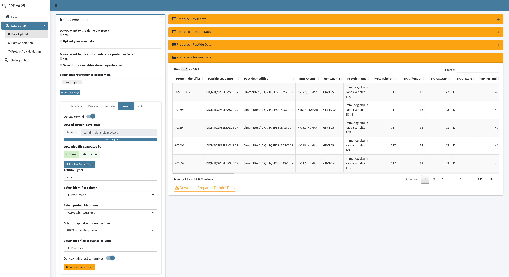

[Add Cover Figure (landscape format)]

### 1. Data Upload

#### Using Example Data
You can bypass the detailed data upload options by selecting the option to use the demo dataset in the “Data Upload” page and clicking the “prepare example data” button. Using example data will set up all data levels to allow you to explore `SQuAPP`’s functionalities. You can view the uploaded data on the app or check the [raw](https://github.com/LangeLab/SQuAPP/tree/main/data/raw/) and [prepared](https://github.com/LangeLab/SQuAPP/tree/main/data/prepared/) files on the Github page.

  

#### Using Your Data
To process your data using `SQuAPP`, provide comma and tab-separated text files or excel files as input. The abundance data for protein, peptide, termini and PTM level information must be uploaded as separate files on the data upload page. The core file for a `SQuAPP` analysis is the **metadata file** which contains the experimental design details. To ensure all relevant information is captured in the metadata file, it should be prepared using the format described in the demo dataset.

**UniProt Reference Proteome Fasta:**

`SQuAPP` expands all levels of data by basic annotations. Therefore, mapping the protein ids to a reference proteome fasta is a crucial requirement. You can select from pre-loaded reference fasta datasets or upload a custom reference fasta dataset. Custom datasets could be required for experiments targeting specific modifications or experimental organisms not included in the list of pre-loaded references. After selecting or uploading the fasta through file input, click the "Load reference(s)" button to complete the reference proteome fasta configuration.

> Here are the ten reference fasta files available and can be accessed from [github](https://github.com/LangeLab/SQuAPP/tree/main/data/uniprot/fasta) at the moment:

- Arabidopsis thaliana
- Bos taurus
- Drosophila melanogaster
- Escherichia coli
- Homo sapiens
- Mus musculus
- Rattus norvegicus
- Saccharomyces cerevisiae

  

Upload experiment files after the reference proteome is loaded and configured. The metadata describing the experiment design, and at least one quantitative data file must be uploaded. All files other files are optional. However, some functionality will only be available if certain data is available. For instance, peptide level data must be uploaded if you want to use the protein re-calculation feature.

##### Metadata

> **Metadata is required for SQuAPP**

The metadata specifies unique sample IDs, common ID for a replica sample, and experiment grouping variables. The sample IDs must match the column names containing the abundance data in the individual data files (protein, termini, peptide and other PTMs). One or several grouping variables are defined by providing a grouping variable name as a column header (e.g. ‘timepoint’) and the association of each sample with one or more groups (e.g. "0hr" or "1hr" or "6hr"). In the analysis, a replica is used to evaluate the data quality and can be averaged to obtain one robust datapoint per condition.

To upload the metadata, first switch on the “Upload metadata” option, which will open the metadata upload preferences. Select the metadata file from its location using the “Browse…” option. Next, select a method in which the data is separated - if the extension of the file is `.xlsx` select excel, if `.tsv` or `.txt` select  tab, and finally if `.csv` select comma option. You can preview the uploaded data by clicking “Preview metadata” to see if the data is uploaded without any mistake.   

  

After data preview for metadata is created, select column names that allow the app to assign required unique ids. The first option is to choose which column in the uploaded metadata is the unique identifier that matches with quantitative sample names in your quantitative file(s).

If at least one of the quantitative data levels contains a replica, you can switch on the “Contains replica” option, requiring you to select a column containing a unique sample name column. This column will be the sample names used in non-replica datasets. If you average replica further down in your analysis, this column will become the unique identifier for the metadata.  When you select the required columns for the app to parse it, you can click the “Prepare Metadata” button to load its metadata.

  

When “Prepare Metadata” is clicked, the “Prepared - Metadata” table will replace the “Preview - Metadata,” and this version of the metadata will be used for other data files. Here is the [example metadata](https://github.com/LangeLab/SQuAPP/blob/main/data/raw/meta_data.csv) used in our demo dataset and provided for users to use. Here are the column descriptions of this example metadata:

- ID (a unique identifier that matches with samples names in quantitative files -> **Required**)
- SampleName (**Required if at least one of the quantitative data has replicas**)
- SampleType (*grouping variable*)
- Disease (*grouping variable*)
- Stage (*grouping variable*)
- Replica (*Optional variable to indicate replica number*)

##### Protein Level
The protein-data file needs to contain at least a unique protein identifier as UniProt accession id format and abundance data in columns matching the subset of or all of the sample names defined in the metadata file.

To upload your protein-data file, you can open the Protein tab and switch on the “Upload protein” to see the options. Select the file as done in the metadata tab and click on the “Preview Protein Data” button to see the uploaded file. This will upload the data and preview it to check if the data is uploaded as expected.

  

When the protein level data preview is created, options to select protein identifier column and replica indicator switch will be available for configuration according to your data analysis framework. As done in metadata, when you select the protein identifier column and switch on the replica indicator if protein data contains replica, you can click “Prepare Protein Data” to finalize the loading process.

  

As seen from the “Prepared - Protein Data” table in the figure above, more protein-related information is created and added to the table using the proteome fasta. This is an initial annotation expansion done when loading the protein data to the app, and many app features benefit from expanded annotation. The loaded data can be downloaded as a comma-separate file and viewed. Here is the [example protein data](https://github.com/LangeLab/SQuAPP/blob/main/data/raw/protein_data.csv) used in the images and provided for users to use in the app. Here are the column descriptions of this **raw example protein data**:

- PG.ProteinAccessions (unique protein identifier -> **Required**)
- NP01_1 … NP044_2 (*Quantitative sampl es matching to unique id in metadata*)

##### Peptide Level
The peptide-data file needs to contain a unique peptide identifier (best to have the stripped sequence), the corresponding protein identifier, and abundance data in columns matching the sample names defined in the metadata file.

To upload your peptide quantitative data file, you need to switch on the “Upload peptide” option to access the upload settings and configurations. The first step is to upload the file and access the uploaded file preview table. Because peptide data is commonly larger than other levels, data upload and preview speed can be slower than other levels. You can wait until the “Preview - Peptide Data” table is created and shown.

  

As it is done for metadata or protein level, the preview of the uploaded data allows you to check it and get column names for reference to configure important column selection to be used to load the data to the app to be used properly. For peptide-data level, three columns are necessary to fully upload the data - identifier column, protein id column and stripped sequence column. Three distinct columns can be accommodated if your data contains a stripped sequence column and identifier column. If you have two columns as example data, you can put the `PEP.StrippedSequence` column for the identifier column and stripped sequence column. Next, indicate if the data contains replicas. Switch on the indicator asking if the samples have replicas. When done selecting relevant columns and selecting whether or not data includes replica click the “Prepare Peptide Data” button to load the data to the app.

  

As an initial data cleaning and handling for the peptide data, `SQuAPP` implements a simple annotation to match gene, protein names, peptide start and end positions relative to its host protein, and some quick match of amino acids if you want to use this expanded data for another use. `SQuAPP` also expands multiple protein matches (e.g. protein groups or families) to their rows to make the data consistent for further analysis. This data can be downloaded with the button located on the bottom left of the “Prepared-Peptide Data” table created in the app. Here is the [example peptide data](https://github.com/LangeLab/SQuAPP/blob/main/data/raw/peptide_data.csv) used in the images and provided for users to use in the app. Here are the column descriptions of this **raw example peptide data**:

- PEP.StrippedSequence (unique peptide identifier -> **Required**)
- PG.ProteinAccessions (corresponding protein identifier -> **Required**)
- NP01_01 … NP044_2 (*Quantitative samples matching to unique id in metadata*)
- PEP.isProteotypic (*Optional - Not used*)

##### Termini Level
The termini-data file needs to contain the following annotation elements for `SQuAPP` to correctly load the data: a unique termini identifier, corresponding protein identifier, stripped sequence, modified sequence, and quantitative sample columns.

> To aid interpretation of the data, “*ProteinAccession-position*” or “*GeneName-position*” can be used as unique termini identifier. However, using a modified sequence as a unique identifier can also be an option for unique termini identifier.

> Termini data directly exported as output from an analysis tool or app may have artifacts or mislabeled information. It is highly recommended you do a pre-filtering for only correctly labelled termini to get the most accurate and informative results in the downstream analysis. For example, `SQuAPP`’s example data contains two files for N-termini data one is [non-filtered](./data/raw/termini_data.csv), and the other is [filtered](./data/raw/termini_data_cleaned.csv) for only correctly-labelled N-terms. *The pre-loaded demo data is based on the filtered N-termini data*.

Similar to other data levels, switch on the “Upload termini” option to upload your termini data. Select the file to upload, correct the file separator, then click “Preview Termini Data” to preview the uploaded data. Check if there are any errors in the upload process. After the data is uploaded, the column selection and configuration will be enabled.

  

Configuration for loading the termini data requires selecting if the data is N-term or C-term based termini data. The “Preview - Termini Data” table can select relevant columns as done in previous data levels. Finally, the replica switch needs to be turned on if the data contains replicas. When the configuration is done, you can click on “Prepare Termini Data” to load the data onto `SQuAPP`.

  

When loading the data, `SQuAPP` applies data cleaning steps to make the data extend its annotation and standardizes the names of the columns to be compatible with other levels if they are provided. The simple annotation includes genes, protein names, peptide start and end positions relative to its host protein, and some quick matches of amino acids. `SQuAPP` also expands multiple protein matches to their rows to make the data consistent for further analysis. This data can be downloaded with the button located on the bottom left of the “Prepared-Termini Data” table created in the app. Here is the [example termini data](https://github.com/LangeLab/SQuAPP/blob/main/data/raw/termini_data_cleaned.csv) used in the images and provided for users to use in the app. Here are the column descriptions of this **raw example termini data**:

- EG.PrecursorID (unique termini identifier & modified sequence -> **Required**)
- PEP.StrippedSequence (stripped sequence -> **Required**)
- PG.ProteinAccession (protein accession ids - > **Required** )
- NP01_01 … NP044_2 (*Quantitative samples matching to unique id in metadata*)

##### PTM Level
The PTM-data file needs to contain the following annotation elements for `SQuAPP` to load the data correctly: a unique ptm identifier, corresponding protein identifier, stripped sequence, modified sequence, and quantitative sample columns.

> To aid interpretation of the data, we recommend the use of “ProteinAccession-PTMtype-position” or “GeneName-PTMtype-position” as a unique identifier.

Similar to other data levels, to upload the ptm data, switch on the “Upload ptm” option. Select the file to upload, correct the file separator, then click “Preview PTM Data” to preview the uploaded data. Check for any errors in the upload process. After the data is uploaded, the column selection and configuration will be enabled.

  

Configuration for loading the ptm data requires selecting the PTM type. (Version 0.25 only has Phosphorylation for PTM type. However, `SQuAPP` is in active development to add more PTM types and features to expand its capabilities). The “Preview - PTM Data” table can select relevant columns as done in previous data levels. Finally, the replica switch needs to be turned on if the data contains replicas. (In our example data phospho data doesn’t contain replicas, so we leave it off)  When the configuration is done, you can click on “Prepare PTM Data” to load the data onto `SQuAPP`.

  

PTM data is cleaned and prepared the same way as the termini data level. `SQuAPP` extends its annotation with gene, protein names, peptide start and end positions relative to its host protein, and some quick matches of amino acids. `SQuAPP` also expands multiple protein matches to their rows to make the data consistent for further analysis. This data can be downloaded with the button located on the bottom left of the “Prepared-PTM Data” table created in the app. Here is the [example ptm data](https://github.com/LangeLab/SQuAPP/blob/main/data/raw/phospho_data.csv) used in the images and provided for users to use in the app. Here are the column descriptions of this **raw example ptm data**:

- PTM_collapse_key (unique ptm identifier -> **Required**)
- PG.ProteinGroups (protein accession ids - > **Required**)
- PTM_group (modified sequence -> **Required** )
- PEP.StrippedSequence (stripped sequence -> **Required**)
- PEP.PeptidePosition (ptm position -> not required and used)
- PTM_type (ptm type -> not required as column and not used)

---

### 2. Data Annotation

> **Requires at least termini or PTM data to be loaded to the app!**

Termini or PTM data can be further annotated to derive the sequence context of the modification site. In the current version, the annotation tool expands the initial annotation applied when preparing the uploaded data by including specific modification sites and modification-specific sequence windows. The annotation is used for protein domain and circular network summary plots. The expanded annotated version of termini or ptm data can also be downloaded for use in external applications, such as in RoLiM **(1)**.

  

Apart from the initial annotation, the data annotation section, as shown above, adds the following columns:

- `Window.size`: (user-selected residue expand * 2) + 1
- `PEP.End.window`: Window created from ending amino-acid of the peptide centred in the middle
- `PEP.Start.window`: Window created from starting amino-acid of the peptide centred in the middle
- `PTM.Protein.Pos`: Modification’s relative position on the protein
- `PTM.PEP.Pos`: Modification’s relative position on the peptide
- `PTM.AA`: Modified amino-acid
- `PTM.Window`: Sequence window created from the modified amino-acid centred in the middle

---

### 3. Protein Re-calculation
If a peptide dataset has been uploaded, one can choose to calculate protein intensities from peptides with multiple options provided by `SQuAPP`. Here are the methods provided by `SQuAPP`:

- `Sum of All`: Method summing all the intensities of peptides matching to the same protein
- `Average All`: Method takes the average of all the intensities of peptides matching to the same protein
- `Sum of top 3`: Method summing top intensity three peptides for the matching protein
- `Average of top 3`: Method averaging top intensity three peptides for the matching protein

When a method is selected and the “Re-calculate Proteins” button is clicked, `SQuAPP` calculates protein intensities. Then shows the calculated protein level data as a table on the top and a visualization showing the distribution of the computed protein intensities as a violin plot.

> If protein-level data is provided in the data-upload section, the visualization becomes a split violin to show a sample-wise comparison of the original and calculated protein intensities.

  

The “Keep as protein data” switch becomes available when the data is calculated. If you want to keep this data as the protein data or replace it with the original protein data, then switch on “Keep as protein data” and click the “Record Proteins” option.

---

**Bibliography**
1.    [Smith TG, Uzozie AC, Chen S, Lange PF. Robust unsupervised deconvolution of linear motifs characterizes 68 protein modifications at proteome scale. Sci Rep. 2021 Nov 18;11(1):22490.](https://www.nature.com/articles/s41598-021-01971-3)
