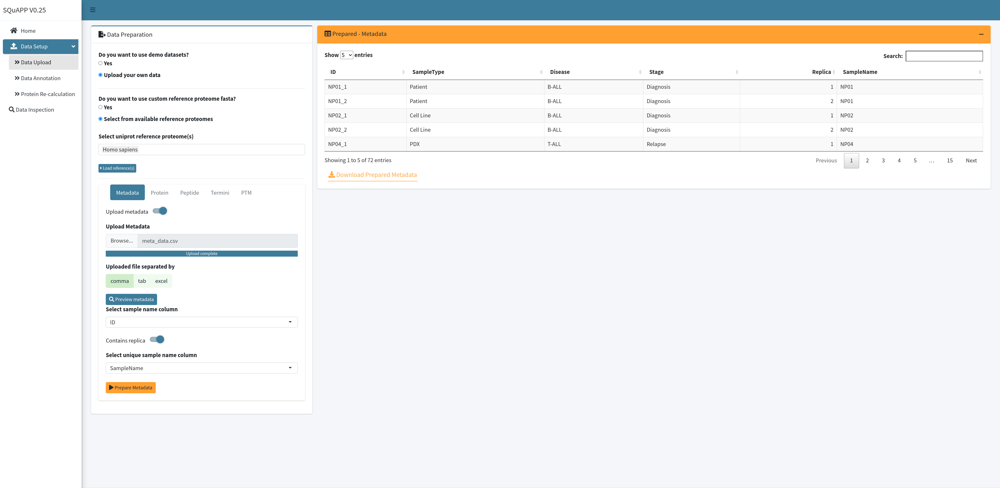

### Data Upload

#### Using Example Data
You can bypass the detailed data upload options by selecting using demo dataset option in the “Data Upload” page and clicking the “prepare example data” button. This will set up all data levels to allow you to explore SQuAPP’s functionalities. You can view the uploaded data on the app or check the [raw](https://github.com/LangeLab/SQuAPP/tree/main/data/raw/) and [prepared](https://github.com/LangeLab/SQuAPP/tree/main/data/prepared/) files on the Github page.

#### Using Your Own Data
For utilizing SQuAPP with your own data you can provide comma and tab-separated text files as well as excel files as input. The abundance data for protein, peptide, termini and PTM level information must be uploaded as separate files on the data upload page. The centrepiece of a SQuAPP analysis is the metadata file which captures the experimental design details.

**UniProt Reference Proteome Fasta:**

Because SQuAPP expands annotation of all levels of data in one way or another mapping the identified or corresponding proteins to reference proteome fasta is an important step. You can select from pre-loaded reference fasta datasets or upload a custom reference fasta if your experiments specifically use a modified fasta or your experiment organism is not in the list of pre-loaded references. After selecting or uploading the fasta through file input, click the "Load reference(s)" button to complete the reference proteome fasta configuration.

> Here are the 10 reference fasta files available and can be access from [github](https://github.com/LangeLab/SQuAPP/tree/main/data/uniprot/fasta) at the moment:

- Arabidopsis thaliana
- Bos taurus
- Drosophila melanogaster
- Escherichia coli
- Homo sapiens
- Mus musculus
- Rattus norvegicus
- Saccharomyces cerevisiae

After the reference proteome is loaded in the app, the next step is to upload experiment files. All files except for the metadata describing the experiment design and at least one quantitative data file are optional. However, some functionality will only be available if certain data is available. For instance, peptide level data must be uploaded if you would like to use the protein re-calculation feature.

##### Metadata

> **Metadata is required for SQuAPP**

The metadata specifies unique sample IDs, common ID for a replica sample, and experiment grouping variables. The sample IDs must match the column names containing the abundance data in the individual data files (protein, termini, peptide and other PTMs). One or several grouping variables are defined by providing a grouping variable name as a column header (e.g. ‘timepoint’) and the association of each sample with one or more groups (e.g. "0hr" or "1hr" or "6hr"). In the analysis, a replica is used to evaluate the data quality and can be averaged to obtain one robust datapoint per condition. PTMs).

To upload the metadata first switch on the “Upload metadata” option, which will open the metadata upload options. After selecting a file from your computer over the “Browse…” option select a method in which the data is separated. (If the extension of the file is `.xlsx` select excel, if `.tsv` or `.txt` select  tab, and finally if `.csv` select comma option) You can preview the uploaded data by clicking “Preview metadata” to see if the data is uploaded without any mistake.

After data preview for metadata is created now you can select column names that allow the app to assign required unique ids. The first option is to select which column in the uploaded metadata is the unique identifier that matches with quantitative sample names in your quantitative file(s).

If at least one of the quantitative data levels contains a replica, you can switch on the “Contains replica” option which will require you to select a column that contains a unique sample name column. This column will be the sample names used in non-replica datasets or if you average replica further down in your analysis this column will become the unique identifier for the metadata.  When you are done selecting the required columns for the app to parse it you can click the “Prepare Metadata” button to finish loading the metadata to the app.

When “Prepare Metadata” is clicked the “Prepared- Metadata” table will replace the “Preview - Metadata”, and this version of the metadata will be used for other data files. Here is the [example metadata](../../data/raw/meta_data.csv) that is used in the images and provided for users to use. Here are the column descriptions of this example metadata:

- ID (a unique identifier that matches with samples names in quantitative files -> **Required**)
- SampleName (**Required if at least one of the quantitative data has replicas**)
- SampleType (*grouping variable*)
- Disease (*grouping variable*)
- Stage (*grouping variable*)
- Replica (*Optional variable to indicate replica number*)

##### Protein Level
The protein-data file needs to contain at least a unique protein identifier as UniProt accession id format and abundance data in columns matching the sample names defined in the metadata file.

- [Example protein data](../../data/raw/protein_data.csv)
  - PG.ProteinAccessions (unique protein identifier -> **Required**)
  - NP01_1 … NP044_2 (*Quantitative samples matching to unique id in metadata*)

##### Peptide Level
The peptide-data file needs to contain at least a unique peptide identifier (best to have the stripped sequence), the corresponding protein identifier, and abundance data in columns matching the sample names defined in the metadata file.

- [Example peptide data](../../data/raw/peptide_data.csv)
  - PEP.StrippedSequence (unique peptide identifier -> **Required**)
  - PG.ProteinAccessions (corresponding protein identifier -> **Required**)
  - NP01_01 … NP044_2 (*Quantitative samples matching to unique id in metadata*)
  - PEP.isProteotypic (*Optional - Not used*)

##### Termini Level

##### PTM Level

---

### Data Annotation

### Protein Re-calculation
