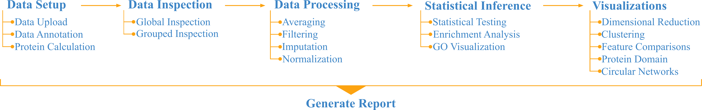

## `SQuAPP` *Version 0.30*
**S**imple **Qu**antitative **A**nalysis of **P**eptides and **P**roteins (`SQuAPP`) is a workflow-based web application built on R-Shiny to enable a rapid high-level analysis of quantitative proteomics data. `SQuAPP` provides streamlined and straightforward access to many aspects of typical downstream analysis done with quantitative proteomics data. `SQuAPP` facilitates combined statistical analysis of multiple levels of proteomics data, including peptide, protein, post-translational modifications and termini modification, and allows for visual comparisons using a variety of plots and table formats.

Mandatory quality control and conscious pre-processing early in the workflow ensure that only robust data are quantitatively evaluated and visualized. The processed datasets can be downloaded for further custom analysis, and the comprehensive report supports record keeping and allows for easy sharing with colleagues and collaborators.

---

#### Functionality

`SQuAPP` is a flexible application, and its functions can be applied in a non-sequential order as long as the requirements for a specific function are met. `SQuAPP` also can be used to follow a sequential workflow-driven approach.

  

---

#### Quick Start
You can start exploring the `SQuAPP` right now using our pre-loaded example data containing protein, phosphorylation and N termini level data comparing primary leukemic cells with matched patient-derived xenografts.[**(Uzozie et al. 2021)**](https://jeccr.biomedcentral.com/articles/10.1186/s13046-021-01835-8)

---

#### Help
A detailed tutorial on how to use `SQuAPP` can be accessed in the respective tabs for section - Data Setup, Data Inspection, Data Preprocessing, Statistical Inference, Summary Visualizations, and Generate a Report.

---

#### About `SQuAPP`
`SQuAPP` has been developed by **Enes Kemal Ergin** & **Siyuan Chen** with contributions from **Anuli Uzozie**, **Ye Su**, and **Philipp Lange** at BC Children’s Hospital & the University of British Columbia.

You can cite the SQuAPP **"Ergin, E. K., Uzozie, A. C., Chen, S., Su, Y. & Lange, P. F. SQuAPP - Simple Quantitative Analysis of Proteins & PTMs. Bioinformatics (2022) [doi:10.1093/bioinformatics/btac628.](https://doi.org/10.1093/bioinformatics/btac628)"**

The source code for `SQuAPP` is available at [SQuAPP Github Page](https://github.com/LangeLab/SQuAPP/).

For any feedback, comments, and questions please contact:

- Enes Kemal Ergin: [Email](mailto:eneskemalergin@gmail.com), [Twitter](https://twitter.com/eneskemalergin)
- Philipp Lange: [Email](mailto:philipp.lange@ubc.ca), [Twitter](https://twitter.com/Lange_Lab)

Or you can directly submit an issue on `SQuAPP`'s [GitHub page](https://github.com/LangeLab/SQuAPP/issues/new).

---

#### Change Log

  
 <b>Version 0.30</b> - May 28th 2023 

    <ul>
      <li> Major bug fixes </li>
      <li> Moved the UI condition checker to server side  </li>
      <li> Added more tests prior to initializing any analysis </li>
      <li> Added better error handling and messaging </li>
    </ul>

  
 <b>Version 0.29</b> - May 1st 2023 

    <ul>
      <li> Various bug fixes </li>
      <li> Markdown mistake fixes </li>
      <li> Adding more content for the generated report </li>
    </ul>

  
 <b>Version 0.28</b> - August 1st 2022 

    <ul>
      <li> Various bug fixes </li>
      <li> Updated tutorials with more references, links, descriptions </li>
      <li> Fixed logical mistake in the custom imputation </li>
    </ul>

  
 <b>Version 0.27</b> - December 13th 2021 

    <ul>
      <li> Various bug fixes and ui updates </li>
      <li> Blocking option in statistical testing is disabled </li>
      <li> Update Global coefficient of variation based QC plot </li>
      <li> Generate a report section is initialized </li>
    </ul>

  
 <b>Version 0.26</b> - December 8th 2021 

    <ul>
      <li> Various bug fixes and ui updates </li>
      <li> More compact protein domain visualization </li>
      <li> More filtration options for circular network plot </li>
      <li> Additional combinations to select in circular network plot </li>
      <li> Customizable colouring for circular network plot </li>
    </ul>

  
 <b>Version 0.25</b> - December 1st 2021 

    <ul>
      <li> Working version made public </li>
    </ul>

