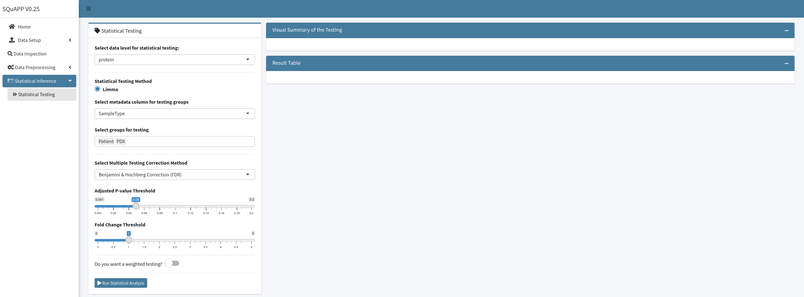
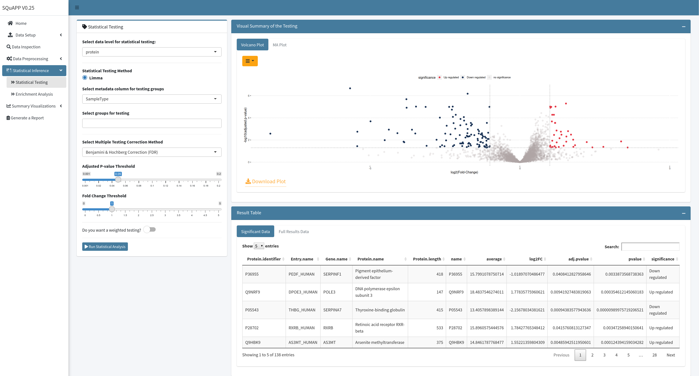
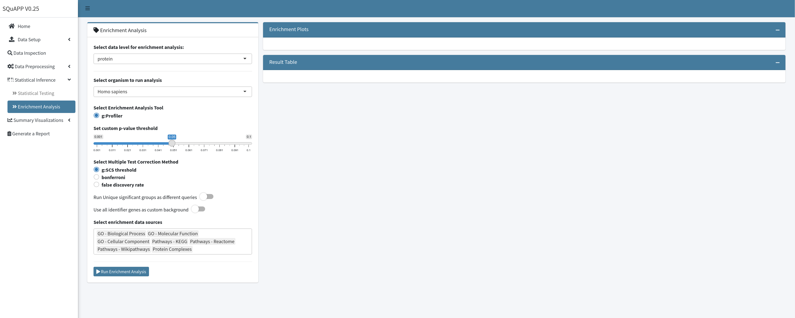
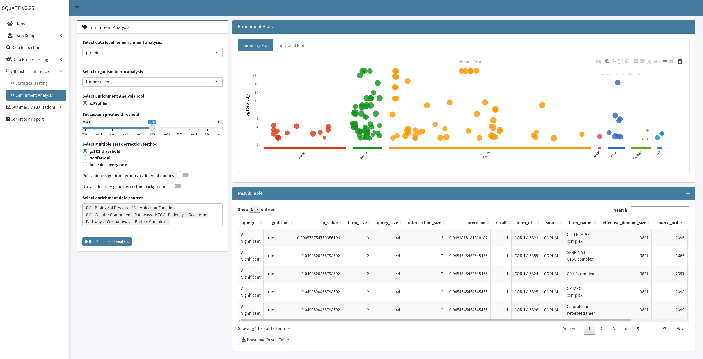

[Add Cover Figure (landscape format)]

Once the data has been processed, statistically significant differences between conditions can be determined. The next step of summary visualizations is useful to gain deeper insights on the set(s) of proteins, termini, or PTM sites within and across experimental conditions.

### 1. Statistical Testing
`SQuAPP` employs the linear model from the [`limma`](https://www.bioconductor.org/packages/release/bioc/html/limma.html) package<b>[1](#Bibliography)</b> for statistical testing, one of the most flexible and popular methods employed in proteomics. (*However, more methods are under development to provide different options for users.*) As of version 0.28, the reported p-values are adjusted according to the Bonferroni-Hochberg (FDR) method as default. More multiple testing corrections methods are available through the [`p.adjust()`](https://www.rdocumentation.org/packages/stats/versions/3.6.2/topics/p.adjust) function from the [`stats`](https://www.rdocumentation.org/packages/stats/versions/3.6.2) package, and they can be selected from the dropdown menu.  

`SQuAPP` implements the weighting option, originally implemented in [`limma`](https://www.bioconductor.org/packages/release/bioc/html/limma.html)<b>[1](#Bibliography)</b> to control quality weights in the microarray data analysis<b>[2](#Bibliography)</b>. `SQuAPP` can place different weights on original/imputed values when the weighting option is selected with testing for differential abundance. This is particularly relevant in scenarios where a PTM or terminus is genuinely absent in one condition but not consistently detected in the other condition. By giving a low weight to imputed values, the measured values become the determining factor when calculating the mean and variance in conditions where many but not all samples have a measurement. At the same time, in conditions where a feature has not been measured, imputed values dominate regardless of their low weight.

  

After selecting the data level for statistical testing, you can select a grouping factor to apply the linear model with unique groups. `SQuAPP` provides sliders to select adjusted p-value and fold-change thresholds. Choose either weighting or blocking options to access use and access the preferences for either selection. If the weighting option is activated, `SQuAPP` asks you to select a weighting number to assign, so the effect of the imputed values is multiplied by that weight.

When all the configuration for testing is done, you can click the “Run Statistical Analysis” button to initiate the analysis, produce plots and result datasets. The visualizations are on the top box, and the data tables are on the bottom. All the plots and data tables can be downloaded individually for reference.

  

`SQuAPP` automatically saves and attaches the statistical result table to the original data level for the analysis. If there is a need to change or update your statistical test with a different configuration, regardless of changes in this section or previous sections, re-running the test by clicking the button will update the statistical result data.

---

### 2. Enrichment Analysis
Another essential step in a data analysis workflow is to create a list of interesting biological matches from the proteomic data. `SQuAPP` employs the help of the [`gprofiler2`](https://cran.r-project.org/web/packages/gprofiler2/index.html) package<b>[4](#Bibliography)</b>, which is an API for the web-based [`g:Profiler`](https://biit.cs.ut.ee/gprofiler/gost) tool<b>[4](#Bibliography)</b>.

> (*Additional methods using other Enrichment Analysis software are under development to provide users with more alternatives.*)

  

`SQuAPP` **requires statistical testing to be run** for the selected data level to run the enrichment analysis. `SQuAPP` allows you to configure the following when running the analysis:

- *p-value threshold selection*
- *multiple testing correction method selection*
- *enrichment sources selection*
- *running significance groups as separate or together*
- *usage of identifier proteins as custom background*

  

---

### 3. GO Visualization

> **This section is still under development**

---

<b>Bibliography</b>

1. [Ritchie ME, Phipson B, Wu D, Hu Y, Law CW, Shi W, et al. limma powers differential expression analyses for RNA-sequencing and microarray studies. Nucleic Acids Res. 2015;43:e47.](https://doi.org/10.1093/nar/gkv007)
2. [Ritchie ME, Diyagama D, Neilson J, van Laar R, Dobrovic A, Holloway A, et al. Empirical array quality weights in the analysis of microarray data. BMC Bioinformatics. 2006;7:261.](https://bmcbioinformatics.biomedcentral.com/articles/10.1186/1471-2105-7-261)
3. [Kolberg L, Raudvere U, Kuzmin I, Vilo J, Peterson H. gprofiler2 -- an R package for gene list functional enrichment analysis and namespace conversion toolset g:Profiler. F1000Res. 2020;9.](https://f1000research.com/articles/9-709/v2)
4. [Raudvere U, Kolberg L, Kuzmin I, Arak T, Adler P, Peterson H, et al. g:Profiler: a web server for functional enrichment analysis and conversions of gene lists (2019 update). Nucleic Acids Res. 2019;47:W191–8.](https://doi.org/10.1093/nar/gkz369)
