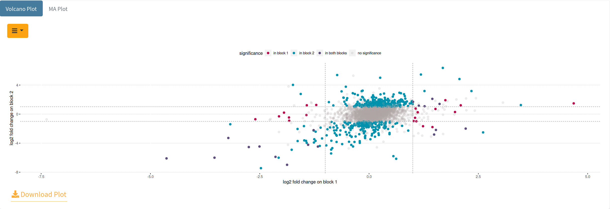

[Add Cover Figure (landscape format)]

Once the data has been processed, statistically significant differences between conditions can be determined. This set of proteins, termini, or PTM sites, can then be used to gain deeper insights in the next step of summary visualizations.

### 1. Statistical Testing
SQuAPP employs the linear model from the `limma` package [REF] for statistical testing since it is one of the most flexible and popular methods employed in the field of proteomics. (*However, more methods are under development to provide different flavours for users who want to use other methods.*) As of version 0.25, the reported p-values adjusted according to the Bonferroni-Hochberg method for both tests, with more options are going to be added soon. SQuAPP adds *“weighting”* and *“blocking”* options to provide additional functionality when employing statistical testing on your data.

- **Blocking**: Blocking is a technique for dealing with nuisance factors that have some effect on the response but are of no interest. Hence the influence on the response variable needs to be minimized or ruled out. Currently, the blocking factor can be a 2-level factor only.
- **Weighting**: SQuAPP introduced a function that allows the user to put different weights on original/imputed values in the testing differential abundance. This is particularly relevant in scenarios where a PTM or terminus is genuinely absent in one condition but not consistently detected in the other condition. By giving a low weight to imputed values, the measured values become the determining factor when calculating the mean and variance in conditions where many but not all samples have a measurement. At the same time, in conditions where a feature has not been measured, imputed values dominate regardless of their low weight.

  

After selecting the data level for statistical testing, you can select a grouping factor to apply the linear model with unique groups. SQuAPP provides sliders to select adjusted p-value and fold-change thresholds in the testing. If you would like to use weighting or blocking you can switch on those options to access their specific options. When the weighting option is activated, SQuAPP asks you to select a weighting number to assign so the effect of the imputed values is multiplied by that weight.  When the blocking option is activated, SQuAPP asks you to select a grouping factor and only 2 groups to apply in the statistical testing. The blocking option replaces the traditional volcano plot with a block volcano plot, using log2 fold changes of blocks one and two on the x and y axis.

  

When all the configuration for testing is done you can click the “Run Statistical Analysis” button to run the analysis to produce plots and result datasets. The visualizations are on the top box and the data tables are on the bottom box. All the plots and data tables can be downloaded individually for reference.

  

SQuAPP automatically saves and attaches the statistical result to the selected data level. If you would like to change or update your statistical test changing the parameters and running the test by clicking the button will update the data.

---

### 2. Enrichment Analysis
Another essential step in a data analysis workflow is to create a list of interesting biological matches from the proteomic data. SQuAPP employs the help of the `gprofiler2` package, which is an API for the web-based `g:Profiler` tool [REF]. (*However, more methods using different tools are under development to provide additional flavours.*)

  

SQuAPP **requires statistical testing to be run** for the selected data level to run the enrichment analysis. SQuAPP allows you to configure the following when running the analysis:

- *p-value threshold selection*
- *multiple testing correction method selection*
- *enrichment sources selection*
- *running significance groups as separate or together*
- *usage of identifier proteins as custom background*

  

---

### 3. GO Visualization

> **This section is still under development**

---

### References
