[Add Cover Figure (landscape format)]

The last step in the workflow entails visualizing quantitative differences between samples and conditions, first at the dataset level using dimensionality reduction and clustering approaches, and then at the level of individual proteins, PTMs, termini and their relationships.

### 1. Dimensional Reduction
Dimensional reduction is a frequently used data analysis step for high-dimensional data **(1)**. Dimensional reduction can be done to all features or for a subset to denoise and simplify the high-dimensional data. `SQuAPP can perform dimensionality reduction on all features in datasets or a selected subset of features. More subset options will be available in the statistical testing that has been completed for the selected data level. (e.g. in the provided example dataset, this could be all significant, only up, or only down-regulated subsets for a comparison between Normal and B-ALL data).

`SQuAPP` offers three commonly used methods to reduce dimensions in high-dimensional data:

- `PCA`: “principal component analysis” implemented using `stats::prcomp()` function.
- `t-SNE`: “t-distributed stochastic neighbour embedding” is implemented using `Rtsne::Rtsne()` function.
	- Allows additional “perplexity” option to be selected when running the dimensional reduction.
- `UMAP`:  “Uniform manifold approximation and projection” is implemented using `umap::umap()` function.

`SQuAPP` produces a customizable scatter plot with two dimensions based on the method used. You can include a colour and/or a shape variable from the metadata in the main configuration box. Aside from the colour and shape, further customization of these plots can be done by opening the plot settings menu located on the top left corner of the plot. In the plot settings menu, you can change more aspects of the plot for downloading or for reference.

  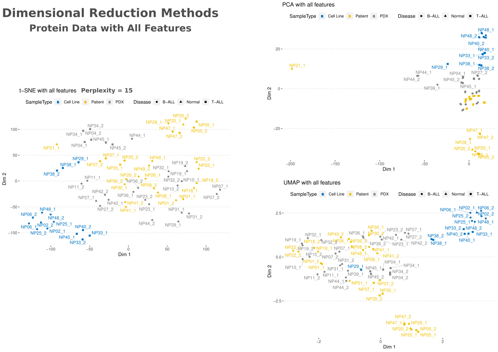

`SQuAPP` also provides the reduced table in the bottom box. The reduced table results from a dimensional reduction method merged with metadata to create a reference for users who would like to access the dataset used to produce the reduced plot (see the plot in the figure below).

  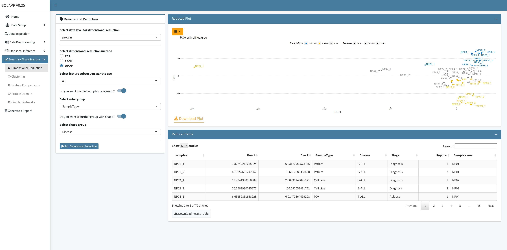

---

### 2. Clustering
Since clustering is a subjective statistical analysis, different clustering methods can be appropriate for different datasets. This section provides clustering as unsupervised learning, implementing clustering on all or a subset of features in the selected data level. `SQuAPP` allows the subset selection in the clustering to take all features if no statistical testing is done prior. More subset options will be available depending on the statistical tests completed for the selected data level. (e.g. all significant, up, or down-regulated subsets become available).

> **Note:** Rows with NA values are not handled in this section, and they are implicitly dropped.

`SQuAPP` offers four distinct clustering methods implemented from various packages in R:

- `Hierarchical Clustering`: *hierarchical clustering is implemented from `factoextra::hcut()`*
- `K-means Clustering`: *k-means clustering is implemented from `stats::kmeans()`*
- `Fuzzy Clustering`: *fuzzy clustering is implemented from `cluster::fanny()`*
- `Hierarchical K-Means Clustering`:  *hybrid hierarchical k-means clustering is implemented from `factoextra::hkmeans()`*

  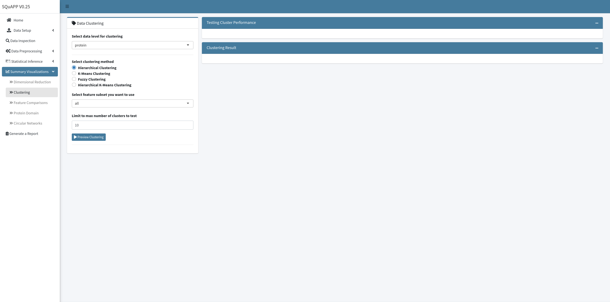

`SQuAPP` requires two steps to get clustering results - running a preview of the clustering and then the actual clustering with selected parameters. In the first step, `SQuAPP` implements three cluster testing visualizations to guide the user in determining the optimum number of clusters for the analysis. `SQuAPP` also gives an option to choose the maximum number of clusters to test in the preview step. The tests implemented to find the optimal number of clusters are implemented using the `factoextra::nbclust()` function:

- `Average Silhouette`: Calculates average silhouette Si **(2)** from silhouette plots for each tested cluster number and plots it. *Measures the clustering quality.* **Higher the average silhouette width is better.**
- `Within Sum of Squares`: (aka. Elbow Method) Calculates the total sum of squares for each tested cluster number and plots it. *Measures the compactness of the clustering*. **The smaller is better. **
- `Gap Statistics`: Calculates the gap statistics **(3)** for each tested cluster. *Compares the total within intra-cluster variation.* *Large gap statistic is better.*

  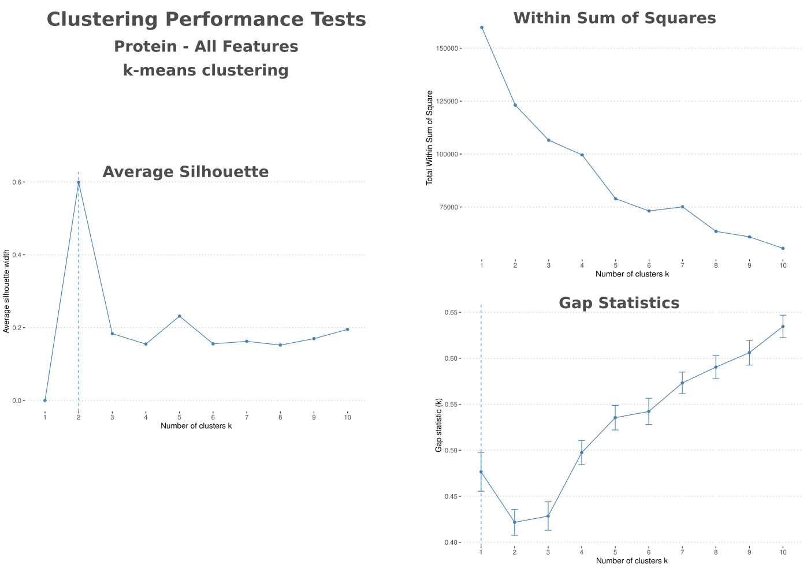

When the user creates and reviews the clustering performance tests, a slider selector will become available to select a number of clusters used in clustering analysis. `SQuAPP` also provides further configuration of the clustering approaches for the different methods to enable more advanced selections for each clustering analysis. When the number of clusters selection and further configuration is completed, click the “Run Clustering” button to run the clustering and create result plots:

-  `Cluster PCA`: plots the clustering on a two dimensional PCA, using `factoextra::fviz_cluster()` function
-  `Cluster Silhouette`: plots silhouette of the created cluster using `factoextra::fviz_silhouette()` function
-  `Cluster Dendogram`: plots a dendrogram using `factoextra::fviz_dend()` function
	- **Only available when using hierarchical clustering and hierarchical k-means clustering**
-  `Cluster Membership Plot`: plots membership values from fuzzy clustering on a matrix.
	- **Only available when using fuzzy clustering**

  

    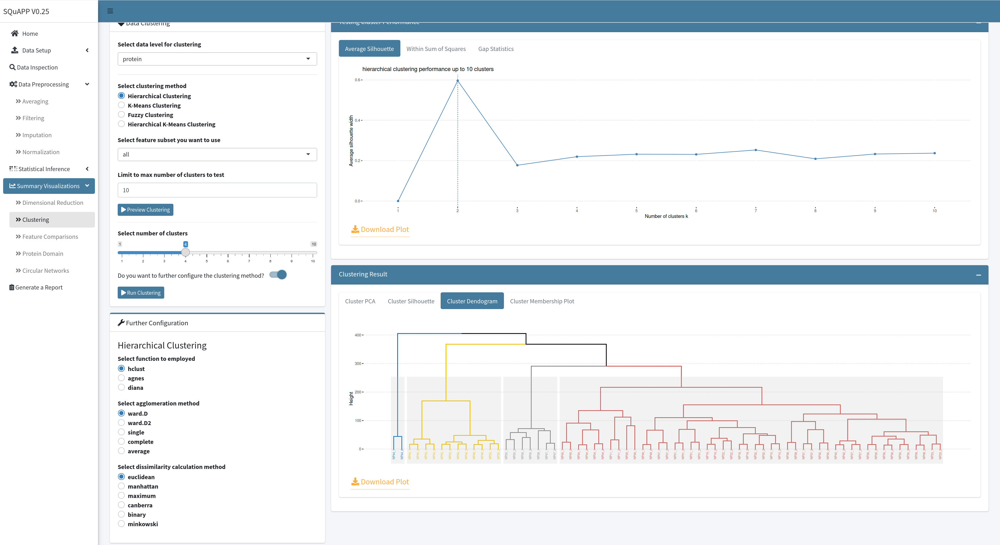
  

---

### 3. Feature Comparison
`SQuAPP` gives an option to compare a small subset of features directly with their intensities in a single intensity plot and a correlation matrix plot if desired. `SQuAPP` accepts three methods to select features for this section; manual input of features separated by a comma, uploading a file with a set of features separated by a new line, and finally directly selecting from a data table that can be created in the feature comparison section.

Suppose the “Select from Statistical Results” option is selected. In this case, `SQuAPP` allows a data table created for selecting features directly from the table when selecting `SQuAPP` prompts for choosing a subset view based on all features or significant only features if the data’s statistical testing step is run prior.

When the “Preview Features” button is clicked after the finished selection will give a preview of the data based on the selection. The preview data table for selected features will be based on the statistical result table if the statistical testing has been done for the data level prior. If the statistical testing for the data is not run, the preview data table will bring up the quantitative data table for the selected data level.

  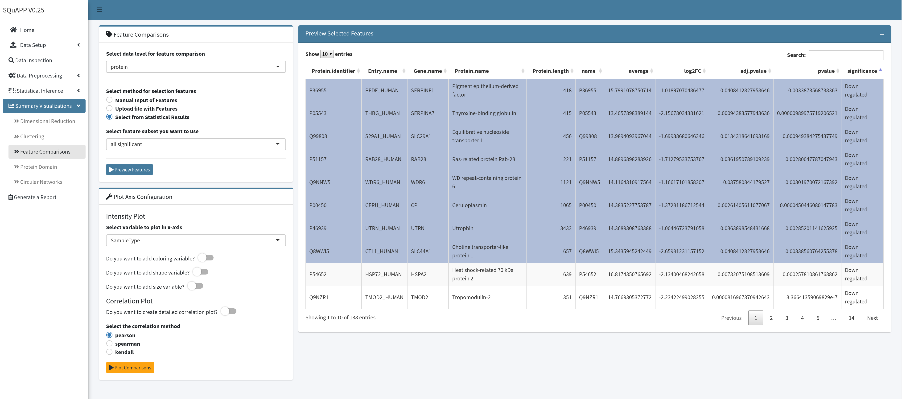

To generate the intensity plot and correlation matrix, at least one row in the preview data needs to be selected. After the rows *up to twelve* are selected and the configuration of the plot box is completed, click on the “Plot Comparisons” button to create comparison visualizations. If changes are done on the “Plot Axis Configuration,” you can update the plot by clicking the “Plot Comparisons” button to apply changes to the plot. If you want to update the feature selection, you must re-create the “Preview Selected Features” table to re-select features to plot.

  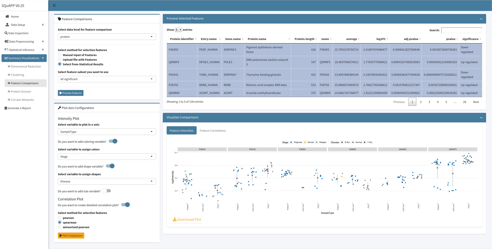

The “Plot Axis Configuration” box provides options to add different variables to the intensity plot, and they can be selected as “colour,” “shape,” or “size.” The “Plot Axis Configuration” box also provides simple options for the correlation matrix plot, such as selecting a correlation method and if you want to plot a simple or detailed correlation matrix.

  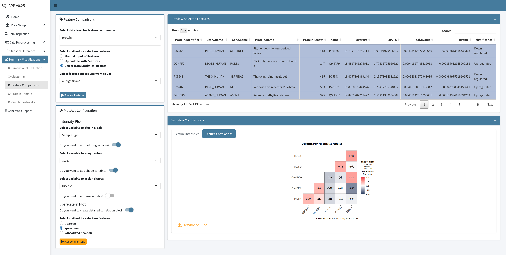

---

### 4. Protein Domain
> **This section requires at least one of the peptide, termini, or ptm datasets to be uploaded and selected in the data selection input.**

This section enables an in-depth inspection of individual features on a specific protein. `SQuAPP`’s hybrid protein domain plot brings the protein domain visualization produced by the `drawProteins` package **(4)** and intensity-based lollipop plot of matching peptide, termini, and ptm level data into a single plot.

  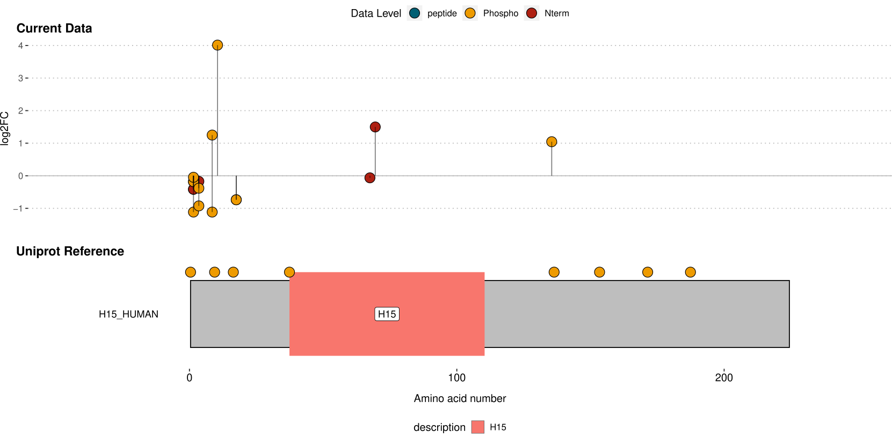

To set up `SQuAPP`’s hybrid plot, you need to select which datasets to include and a method to choose a protein to the plot. To select a protein to visualize, click to highlight the protein entry in the preview table or manually provide the protein’s single Uniprot protein accession identifier.    

  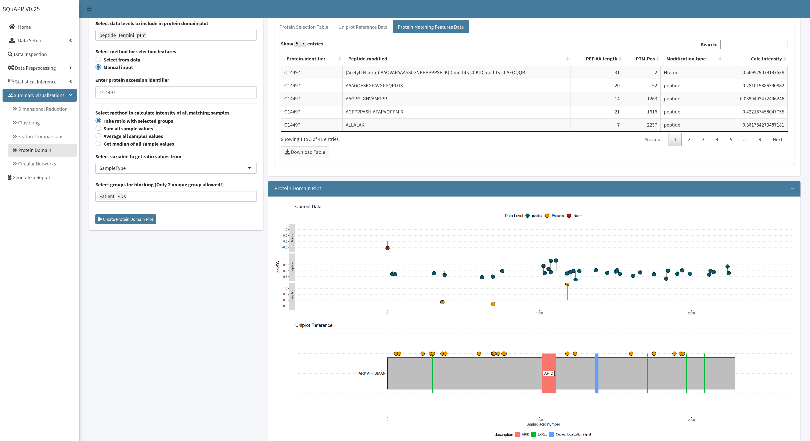

---

### 5. Circular Network Summary
> **This section requires at least 2 data levels to be present. Statistical testing on datasets to include should be conducted in the statistical testing section.**

`SQuAPP`’s circular network summary plot provides a multi-level data summary view and is implemented using the `circlize` package **(5)**.

  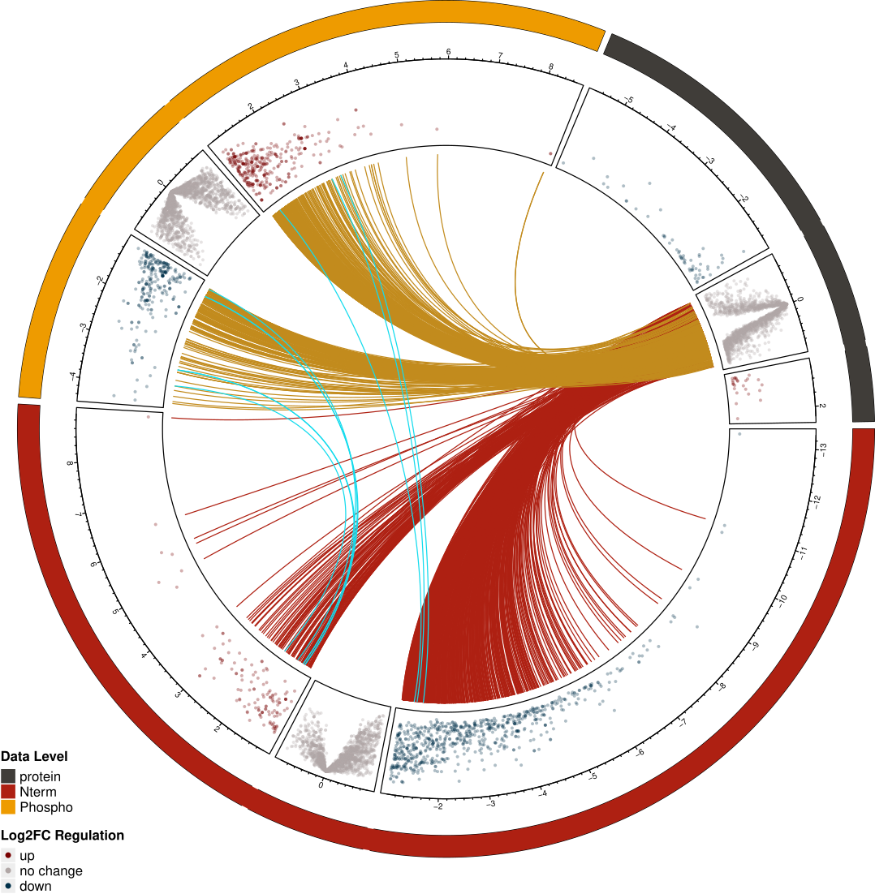

`SQuAPP` creates a circular network summary plot in two steps. First, when the “Combine Datasets” button is clicked, `SQuAPP` creates and includes concatenated data from the selected data levels. While creating the concatenated data, SQuAPP applies a simple pre-filtering to eliminate features that don’t make a connection. For instance, a feature from termini data needs to be matched to a protein, peptide, or ptm within the five amino-acid range to establish a connection. If the feature doesn’t connect to any other datasets in any way, then that feature is dropped in the pre-filtering when making the concatenated data. **Processing the concatenated data can take up to 5seconds depending on the size of data.**

  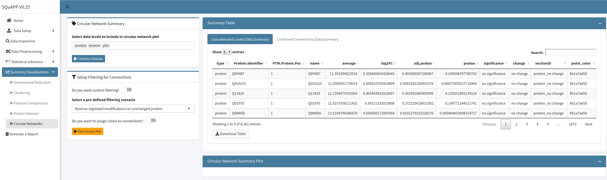

The second step involves creating a circular network summary plot. After the concatenated data is processed and created, the “Setup Filtering for Connections” box will become visible. The filtration step essentially filters the connections that `SQuAPP` will show on the circular plot. There are two options to create the filtering to create the circular plot. The first option is to select a pre-defined filtering scenario from the drop-down menu. The pre-defined scenarios are a quick way to set up the filtering for rapid testing of interesting scenarios.

- `Reverse regulated modifications on unchanged protein`: Only selecting connections that start with unchanged proteins to regulated termini or ptm as well as connections that begin with up-regulated termini to down-regulated ptm or wise versa.
- `Consistent up-regulation of all data levels`: Only selecting connections that begin with up-regulated features to other up-regulated features.
- `Consistent down-regulation of all data levels`: Only selecting connections that begin with down-regulated features to other down-regulated features.
- `Reverse regulated peptide and protein`: Only selecting connections that have reverse regulated protein to peptide connection and regulated peptide to regulated termini, ptm connections.

> *We will be adding more pre-defined filtering scenarios in the future.*

The second option, custom filtration, can be accessed when the “Do you want custom filtering?” switch is turned on.  If the filtration switches for data levels with statistical results are switched off, all available data in the concatenated data will be kept. If you wish to filter individual levels, you need to switch to filter. Filtering can be applied to data based on the log fold change or adjusted p-value threshold set in the statistical analysis step. After the selection for filtering is complete, clicking on the “Plot Circular Network” will generate a plot with all connections defaulting to thin gray lines.

  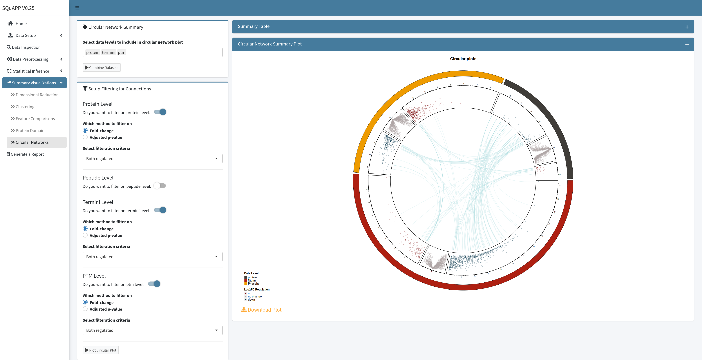

You can switch on the “Do you want to assign colours to connections?” option, If you would like to assign colours to connection groups (e.g. protein-peptide, protein-termini, etc.) Each group can be changed in the colour picker. If you want to change the colour, you need to update the plot by clicking “Plot Circular Plot.”

  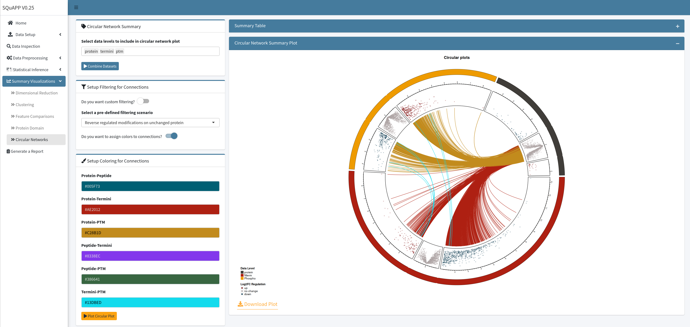

Apart from assigning colours to a group of connections, SQuAPP also allows you to highlight some of the connection lines from the circular network summary plot. You must select rows from the table created in the “Combined Connections Data Summary” tab to highlight several connections. When you select entries from the table, you can click on the “Plot Circular Network” button to re-plot the initial plot with your selected entries added as thicker dark connections.

---

**Bibliography**

1. 	Ivosev G, Burton L, Bonner R. Dimensionality reduction and visualization in principal component analysis. Anal Chem. 2008 Jul 1;80(13):4933–44.
2. 	Rousseeuw PJ. Silhouettes: A graphical aid to the interpretation and validation of cluster analysis. Journal of Computational and Applied Mathematics. 1987 Nov;20:53–65.
3. 	Tibshirani R, Walther G, Hastie T. Estimating the number of clusters in a data set via the gap statistic. J Royal Statistical Soc B. 2001 May;63(2):411–23.
4. 	Brennan P. drawProteins: a Bioconductor/R package for reproducible and programmatic generation of protein schematics. [version 1; peer review: 2 approved]. F1000Res. 2018 Jul 18;7:1105.
5. 	Gu Z, Gu L, Eils R, Schlesner M, Brors B. circlize Implements and enhances circular visualization in R. Bioinformatics. 2014 Oct;30(19):2811–2.
