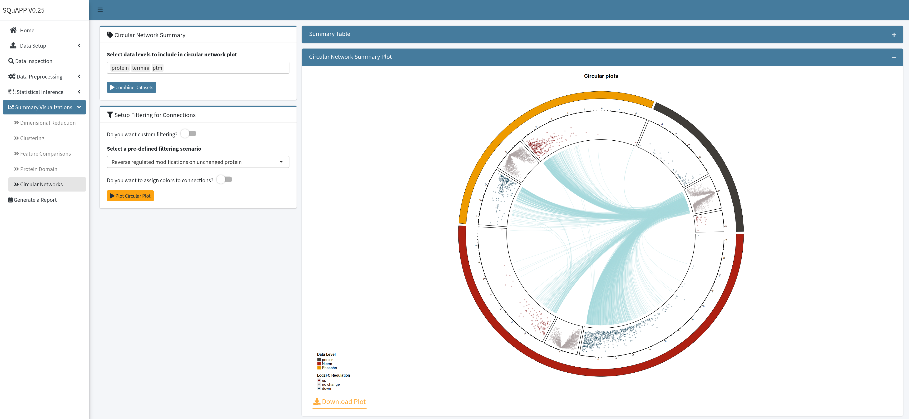

[Add Cover Figure (landscape format)]

The last step in the workflow entails visualizing quantitative differences between samples and conditions, first at the dataset level using dimensionality reduction and clustering approaches and then at the level of individual proteins, PTMs, termini and their relationships.

### 1. Dimensional Reduction
Dimensional reduction is a frequently used data analysis step for high-dimensional data. Dimensional reduction can be done to all features or for a subset to denoise and simplify the high-dimensional data. SQuAPP allows for the subset selection in the dimensional reduction to take all features if no statistical testing is done prior. More subset options will be available depending on the statistical testing if statistical testing has been completed for the selected data level. (e.g. all significant, up, or down-regulated subsets becomes available)

SQuAPP offers three commonly used methods to reduce dimensions in high-dimensional data:

- `PCA`: “principal component analysis” implemented using `stats::prcomp()` function.
- `t-SNE`: “t-distributed stochastic neighbour embedding” is implemented using `Rtsne::Rtsne()` function.
	- Allows additional “perplexity” option to be selected when running the dimensional reduction.
- `UMAP`:  “Uniform manifold approximation and projection” is implemented using `umap::umap()` function.

SQuAPP produces a customizable scatter plot with two dimensions based on the method used. You can include a colour and/or a shape variable from the metadata in the main configuration box. Aside from the colour and shape, further customization of these plots can be done by opening the plot settings menu located on the top left corner of the plot. In the plot settings menu, you can change more aspects of the plot for downloading for reference.

  

SQuAPP also provides the reduced table in the bottom box. The reduced table results from a dimensional reduction method merged with metadata to create a reference for people who would like to access the dataset used to produce the data above.

  

---

### 2. Clustering
Because clustering is a subjective statistical analysis, different clustering methods can be appropriate for different datasets. This section provides clustering as unsupervised learning, implementing clustering on all or a subset of features in the selected data level. SQuAPP allows the subset selection in the clustering to take all features if no statistical testing is done prior. More subset options will be available depending on the statistical testing if statistical testing has been completed for the selected data level. (e.g. all significant, up, or down-regulated subsets become available).

> **Note:** Rows with NA values are not handled in this section, and they are implicitly dropped.

SQuAPP offers four distinct clustering methods implemented from various packages in R:

- `Hierarchical Clustering`: *hierarchical clustering is implemented from `factoextra::hcut()`*
- `K-means Clustering`: *k-means clustering is implemented from `stats::kmeans()`*
- `Fuzzy Clustering`: *fuzzy clustering is implemented from `cluster::fanny()`*
- `Hierarchical K-Means Clustering`:  *hybrid hierarchical k-means clustering is implemented from `factoextra::hkmeans()`*

  

SQuAPP provides two-step to get clustering results, running a preview and running actually clustering with decided parameters. In the first step, SQuAPP implements three cluster testing visualizations to select a number of clusters for clustering analysis. SQuAPP also gives an option to choose the maximum number of clusters to test in the preview step. The tests implemented to find the optimal number of clusters are implemented using the `factoextra::nbclust()` function:

- `Average Silhouette`: Calculates average silhouette Si [REF] from silhouette plots for each tested cluster number and plots it. *Measures the quality of a clustering.* **Higher the average silhouette width is better.**
- `Within Sum of Squares`: (aka. Elbow Method) Calculates total sum of squares [REF] for each tested cluster number and plots it. *Measures the compactness of the clustering*. **The smaller is better.**
- `Gap Statistics`: Calculates the gap statistics [REF] for each tested cluster. *Compares the total within intra-cluster variation.* **Large gap statistic is better.**

  

When the clustering performance tests are created and reviewed by the user, a slider selector will become available to select for number of cluster to be used in clustering analysis. SQuAPP also provides further configuration of the clustering methods to be used with different methods for more advanced control over the clustering analysis. When the number of clusters selection and further configuration is completed you can click “Run Clustering” button to run the clustering to create result plots:

-  `Cluster PCA`: plots the clustering on a two dimensional PCA, using `factoextra::fviz_cluster()` function
-  `Cluster Silhouette`: plots silhouette of the created cluster using `factoextra::fviz_silhouette()` function
-  `Cluster Dendogram`: plots a dendogram using `factoextra::fviz_dend()` function
	- **Only available when using hierarchical clustering and hierarchical k-means clustering**
-  `Cluster Membership Plot`: plots membership values from fuzzy clustering on a matrix.
  - **Only available when using fuzzy clustering**

  

    
  

---

### 3. Feature Comparison
SQuAPP gives an option to compare a small subset of features directly with their intensities in a single intensity plot and a correlation matrix plot if desired. SQuAPP accepts three methods to select features for this section; manual input of features separated by a comma, uploading a file with a set of features separated by a new line, and finally directly selecting from a data table that can be created in the feature comparison section.

Suppose the “Select from Statistical Results” option is selected. In that case, SQuAPP allows a data table created for selecting features directly from the table when selecting SQuAPP prompts for choosing a subset view based on all features or significant only features if the data’s statistical testing step is run prior.

When the “Preview Features” button is clicked after the finished selection will give a preview of the data based on the selection. The preview data table for selected features will be based on the statistical result table if the statistical testing has been done for the data level prior. If the statistical testing for the data is not run, the preview data table will bring up the quantitative data table for the selected data level.

  

To plot the intensity plot and correlation matrix, at least one row in the preview data needs to be selected. After the rows *up to twelve* are selected, and the configuration of the plot box is completed, you can click on the “Plot Comparisons” button to create comparison visualizations. If changes are done on the “Plot Axis Configuration,” you can update the plot by clicking the “Plot Comparisons” button to apply changes to the plot. If you want to update the feature selection, you must re-create the “Preview Selected Features” table to re-select features to plot.

  

The “Plot Axis Configuration” box provides options to add different variables to the intensity plot, and they can be selected as “colour,” “shape,” or “size.” The “Plot Axis Configuration” box also provides simple options for the correlation matrix plot, such as the selection correlation method and if you want to plot a simple or detailed correlation matrix.

  

---

### 4. Protein Domain
> **For this section requires at least one of the peptide, termini, or ptm data levels to be present.**

This section enables an in-depth inspection of individual features on their parent protein. SQuAPP’s hybrid protein domain plot brings the protein domain visualization produced by the `drawProteins` package [REF] and intensity-based lollipop plot of matching peptide, termini, and ptm level data into a single plot.

  

To set up the SQuAPP’s hybrid plot you need to select which levels of data to include and a method to select a protein to the plot. A protein for plotting can be selected from a preview table as done in the “Feature Comparisons” section or manually put into a single UniProt protein accession identifier.    

  

---

### 5. Circular Network Summary
> **This section requires at least 2 data levels to be present. Statistical testing on datasets to include should be conducted in the statistical testing section.**

SQuAPP’s circular network summary plot provides a multi-level data summary view and is implemented using the `circlize` package [REF.]

  

SQuAPP creates a circular network summary plot in two steps. First, SQuAPP creates concatenated data from selected levels of data to include after the “Combine Datasets” button is clicked. In the concatenated data, features that do not match at least one other data level are dropped. **Processing the concatenated data can take up to 5seconds depending on the size of data.**

  

After the concatenated data is processed and created, the “Setup Filtering for Connections” box will become visible, the second step in creating a circular network summary plot. The filtration step essentially filters the connections that SQuAPP will create.  If the filtration switches for data levels with statistical results are switched off, all available data in the concatenated data will be kept. If you wish to filter individual levels you need to switch to filter. There are two options for applying filtering to a data-based log fold change threshold or adjusted p-value threshold set in the statistical results. When the selection for filtering is made, click the “Plot Circular Network” for creating the plot with all connections defaulting to thin gray lines.

  

To highlight some of the connection lines from the circular network summary plot, you must select rows from the table created in the “Combined Connections Data Summary” tab. When you select entries from the table, you can click on the “Plot Circular Network” button to re-plot the initial plot with your selected entries added as thicker dark connections.
